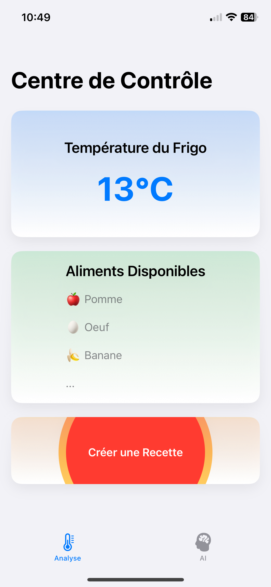
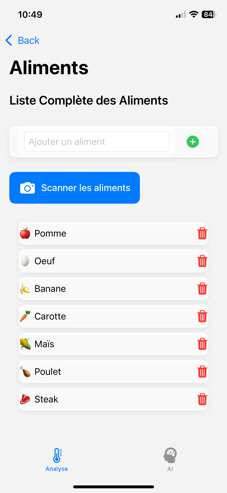
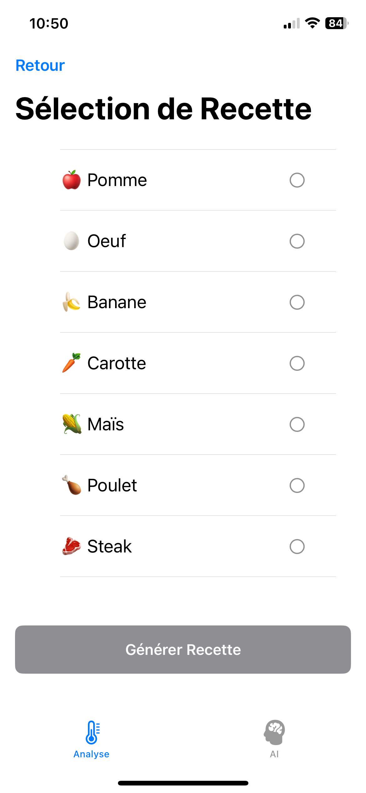
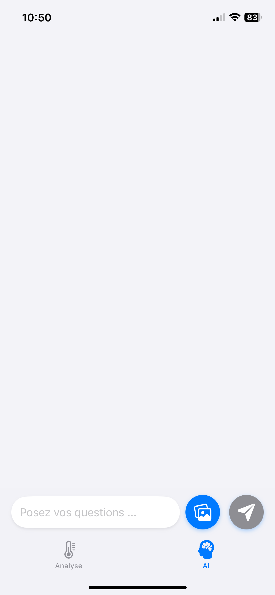

# Mini Frigo Connecté avec IA et Contrôle de Température ❄️🤖

## Description 📄

Ce projet consiste en la conception et la fabrication d'un réfrigérateur connecté utilisant la technologie **Peltier** pour le refroidissement. Il intègre :
- Une **API** pour le suivi des températures 📊.
- Une **application mobile** pour la visualisation des données et des notifications 📱.
- Une **intelligence artificielle** pour la gestion des aliments et la création de recettes 🍽️.
- Un **chatbot IA** pour une interaction dynamique 🤖.

Le système permet également de contrôler la température en temps réel via des capteurs et de recevoir des alertes si la température devient trop élevée 🔥.

Si le projet vous intéresses vous pouvez vous renseignez sur le rapport du projet  
[Documentation](https://www.canva.com/design/DAGcLDX6mmI/CFgLAeI5pDOJgWrh9OzPzQ/edit?utm_content=DAGcLDX6mmI&utm_campaign=designshare&utm_medium=link2&utm_source=sharebutton)

## Fonctionnalités 🚀

- **Suivi de la température en temps réel** : Affichage de la température actuelle du réfrigérateur et suivi de son évolution sous forme de graphique 📈.
- **Gestion des aliments** : Liste des aliments présents dans le réfrigérateur et génération de recettes personnalisées en fonction des ingrédients disponibles 🥕🍅.
- **Notifications intelligentes** : Alerte si la température dépasse un seuil critique 🚨.
- **Chatbot IA intégré** : Interaction avec un chatbot IA pour des conseils, des recettes, et des questions sur le réfrigérateur 💬.
- **API et MQTT** : Collecte des données de température via un capteur DHT11 et publication des données sur un serveur MQTT pour le suivi en temps réel 🌐.

## Screenshots de l'application 📸

Voici quelques captures d'écran de l'application mobile, affichées en petite taille et en deux colonnes tout en maintenant la proportionnalité des images :

<table>
  <tr>
    <td></td>
    <td></td>
  </tr>
  <tr>
    <td>Page d'accueil</td>
    <td>Gestion des aliments</td>
  </tr>
  <tr>
    <td></td>
    <td></td>
  </tr>
  <tr>
    <td>Page des recettes</td>
    <td>Chatbot IA</td>
  </tr>
</table>

## Composants 🔧

- **Raspberry Pi 5** : Plateforme centrale pour la gestion de l'API, la communication MQTT, et l'interface utilisateur.
- **Module Peltier** : Technologie utilisée pour refroidir le réfrigérateur ❄️.
- **Capteur de température DHT11** : Pour mesurer la température à l'intérieur du réfrigérateur 🌡️.
- **Raspberry Pi Pico** : Pour contrôler le capteur de température et publier les données sur MQTT et une API.
- **OLLAMA AI** : Modèles de vision et de texte pour l'interaction avec l'IA et la création de recettes 🍲.

## Installation 🛠️

1. **Configurer l'environnement** :
   - Installez les dépendances nécessaires sur votre Raspberry Pi, y compris le serveur MQTT et le framework pour l'API.
   
2. **Brancher le capteur DHT11** :
   - Connectez le capteur de température au Raspberry Pi Pico et assurez-vous que le câblage est correctement configuré 🔌.

3. **Déployer l'API** :
   - Clonez le projet sur votre Raspberry Pi 5.
   - Configurez l'API pour récupérer et traiter les données du capteur de température 💻.

4. **Configurer le MQTT** :
   - Installez et configurez un serveur MQTT local ou utilisez un serveur existant 📡.
   - Assurez-vous que les données de température sont publiées sur le serveur MQTT 🔄.

5. **Développer l'application mobile** :
   - Ouvrez le projet **Xcode** en **Swift**.
   - Configurez l'interface utilisateur pour afficher la température et les graphiques 📱.
   - Intégrez l’API pour récupérer les informations de température 🌍.

6. **Lancer l'IA** :
   - Déployez le modèle OLLAMA sur le Raspberry Pi 5 pour activer les fonctionnalités d'intelligence artificielle 🤖.

## Technologies Utilisées 🧑‍💻

- **Raspberry Pi** (Pi 5 et Pico)
- **Python** pour l'API et la gestion des capteurs 🐍
- **Swift** pour le développement de l’application mobile iOS 📱
- **MQTT** pour la communication en temps réel 🌐
- **OLLAMA AI** pour l'intégration de l'intelligence artificielle 🤖
- **Module Peltier** pour le refroidissement ❄️
- **DHT11** pour la mesure de la température 🌡️

## Auteurs 📝

- Clement

